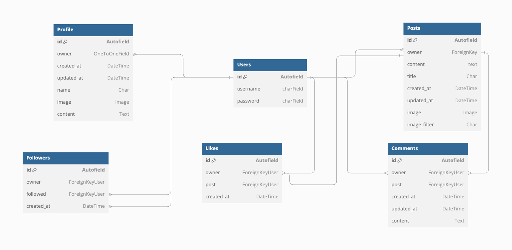
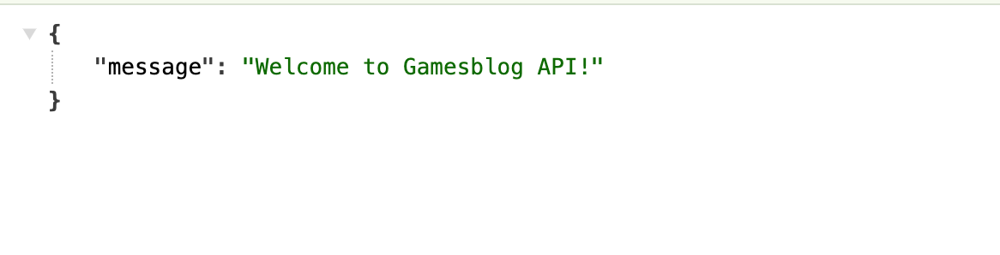

# Games Blog API

**Advanced Front-End Portfolio Project(PP5) - Code Institute**

The *GamesBlog-backend* is the backend for the GamesBlog application, built using Django Rest Framework. It has been designed for a social gaming network ([GamesBlog](https://gamesblog-front-34620d1947f3.herokuapp.com/)) focused on publishing and participating in  posts with friends. 

*GamesBlog* is designed for users who want to create posts from their favourite games or everything related to video games.Each post is also open for like,follow and unfollow users allowing them to stay updated and comments. 

The API is organized into several key apps: 

_profiles_: Handles user profiles and related information. 
_comments_: Enables users to comment on Friendventures. 
_followers_: Facilitates the following and tracking of other users' activities. 
_like_: Option to manage the general interest of the users for a specific post.
 
The deployed API can be found here: [Gamesblog-backend](https://gamesblog-f53e2013614c.herokuapp.com/) 
The deployed React project can be found [here](https://gamesblog-front-34620d1947f3.herokuapp.com/) 
The link for the GitHub repository to the associated front end can be found [here](https://github.com/t0tacci0/gamesblog-frontend)

## Table of Contents

- [User Experience](#user-experience)
- [Structure](#structure)
- [Database](#database)
- [API Endpoints](#api-endpoints)
- [Bugs](#bugs)
- [Technologies Used](#technologies-used)
  - [Languages](#languages)
  - [Tools](#tools)
  - [Frameworks](#frameworks)
  - [Libraries and modules](#libraries-and-modules)
- [Testing](#testing)
  - [Python Validator Testing](#python-validator-testing)
  - [Manual testing](#manual-testing)
  - [Browser Compatibility](#browser-compatibility)
- [Deployment](#deployment)
  - [Heroku](#heroku)
  - [Local deployment](#local-deployment)
  - [Forking this GitHub repository](#forking-this-github-repository)
  - [Clone this repository](#clone-this-repository)
  - [Cloudinary](#cloudinary)
  - [Create PostgreSQL using Code Institute Database Maker](#create-postgresql-using-code-institute-database-maker)
- [Credits](#credits)
  - [Code](#code)
  - [Acknowledgments](#acknowledgments)

## User Experience

I used an Agile methodology approach to plan this project. This was implemented through the GitHub Project board with milestones, epics, user stories and tasks.
Each user story was classified with a label according to MoSCoW prioritization. 
The Kanban board can be seen [here](https://github.com/users/t0tacci0/projects/6/views/1). 

## Structure

The database schema was created with [dbdiagramm](https://dbdiagram.io/home). 

Final ERD: 
 

## Database 
I used a PostgreSQL provided by Code Institute as relational database. 

- **Relationships:** 
  - User to Profile: One-to-One
  - User to Comment: One-to-Many
  - User to Favourite: One-to-Many
  - User to Post: One-to-Many
  - User to Follower: One-to-Many
  - Post to Comment: One-to-Many
  - Post to Favourite: One-to-Many
  - Favourite to User: Many-to-Many (through owner)
  - Favourite to Post: Many-to-Many (through post)
  - Follower to User (as owner): Many-to-Many
  - Follower to Followed User: Many-to-Many  

>
A welcome message is displayed when you first enter the API site.

 

### Features, which I would like to implement in the future

- *Contact assistance Form*: "Integrate a easy contact form for any users having questions."  
- *User-to-User Messaging*: "Implement a direct messaging feature to facilitate communication between users with the option to share images to use for the website." 

## API Endpoints

The endpoints provided by the API are: 

| Endpoint                           | HTTP Method | CRUD Operation |
|------------------------------------|-------------|----------------|
| /dj-rest-auth/registration/        | POST        | N/A            |
| /dj-rest-auth/login/               | POST        | N/A            |
| /dj-rest-auth/logout/              | POST        | N/A            |
| /profiles/                         | GET         | Read           |
| /profiles/\<int:pk\>/              | GET         | Read           |
|                                    | PUT         | Update         |
| /comments/                         | GET         | Read           |
|                                    | POST        | Create         |
| /comments/\<int:pk\>               | GET         | Read           |
|                                    | PUT         | Update         |
|                                    | DELETE      | Delete         |
| /followers/                        | GET         | Read           |
|                                    | POST        | Create         |
| /followers/\<int:pk\>/             | GET         | Read           |
|                                    | DELETE      | Delete         |
| /likes/                            | GET         | Read           |
|                                    | POST        | Create         |
| /likes/\<int:pk\>/                 | GET         | Read           |
|                                    | DELETE      | Delete         |
| /posts/                            | GET         | Read           |
|                                    | POST        | Create         |
| /posts/\<int:pk\>/                 | GET         | Read           |
|                                    | PUT         | Update         |
|                                    | DELETE      | Delete         |

## Bugs

 500 Server error 

 
When attempting to click on SignUP or SignIn pages a conflict btw database server and the project occured.After so many attempts and help from tutor service many times,i found the issue.I had to modify some of the packages in requirements.txt to old version instead and create another database with new migrations.I want to say many thanks to tutor assistance for great support.

 
 

.png) 
.png) 
.png) 
.png) 

## Technologies Used

### Languages:
- [Python](https://en.wikipedia.org/wiki/Python_(programming_language))

### Tools:
- [Git](https://git-scm.com/) Used in Gitpod terminal to commit to Git and Push to GitHub.
- [GitHub](https://github.com/) Used to store file for the project.
- [GitHub Projects](https://docs.github.com/en/issues/planning-and-tracking-with-projects/learning-about-projects/about-projects) Used for Agile sprint planning and task tracking.
- [Heroku](https://www.heroku.com) Used to deploy application.
- [CI Gitpod](https://codeinstitute-ide.net/) IDE.
- [Code Insitute Database Maker](https://dbs.ci-dbs.net/) PostgreSQL database.
- [Background remover](https://www.remove.bg/) Used to remove background logo.
- [LanguageTool](https://languagetool.org/) Used to check the grammar and spelling in the README and the Code. 
- [Cloudinary](https://cloudinary.com/) Used to store the item images.
- [Canva](https://www.canva.com/) Used to create Logo.
- [Favicon.io](https://favicon.io/favicon-generator/) Used to create the favicon.
- [Google Chrome Dev Tools](https://developer.chrome.com/docs/devtools?hl=de) Used to check the application for responsiveness and errors. 

### Frameworks:  
- [Django Rest Framework](https://www.django-rest-framework.org/)
- [Django](https://en.wikipedia.org/wiki/Django_(web_framework))

### Libraries and modules:
- [os](https://docs.python.org/3/library/os.html) Provides functions to interact with the operating system. 
- [sys](https://docs.python.org/3/library/sys.html) Used to get system-specific functions.
- [datetime](https://docs.python.org/3/library/time.html) Supplies classes for manipulating dates and times.
- [Gunicorn](https://gunicorn.org/) Provides a way to serve Python web applications.
- [Pycopg 2](https://pypi.org/project/psycopg2/) PostgreSQL database adapter for Python.
- [sqlparse](https://pypi.org/project/sqlparse/): A non-validating SQL parser for Python.
- [dj_database_url](https://pypi.org/project/dj-database-url/) Enables the ability to represent their database settings via a string.
- [django-cloudinary-storage](https://pypi.org/project/django-cloudinary-storage/): Used to connect Cloudinary as Django file storage.
- [django-cors-headers](https://pypi.org/project/django-cors-headers/): Handle Cross-Origin Resource Sharing in Django.
- [django-filter](https://pypi.org/project/django-filter/): Provides filtering with URL parameters for querysets.
- [dj-rest-auth](https://dj-rest-auth.readthedocs.io/en/latest/): Used to handle user registration, login, and logout.
- [djangorestframework-simplejwt](https://django-rest-framework-simplejwt.readthedocs.io/en/latest/getting_started.html): JSON Web Token authentication for Django REST Framework.
- [oauthlib](https://oauthlib.readthedocs.io/en/latest/): A generic, spec-compliant, thorough implementation of the OAuth request-signing logic.
- [PyJWT](https://pyjwt.readthedocs.io/en/stable/): JSON Web Token implementation in Python.
- [python3-openid](https://pypi.org/project/python3-openid/): A library for implementing OpenID in Python.
- [requests-oauthlib](https://pypi.org/project/requests-oauthlib/): OAuth library that implements the client side of the OAuth protocol.
- [dj-database-url](https://pypi.org/project/dj-database-url/): A simple utility to allow using Database URLs in Django.
- [whitenoise](https://whitenoise.readthedocs.io/en/latest/): A Django middleware to serve static files.
- [asgiref](https://github.com/django/asgiref): ASGI (Asynchronous Server Gateway Interface) reference library, used by Django for handling asynchronous web protocols.
- [pillow](https://pypi.org/project/pillow/): A Python Imaging Library (PIL) fork, adding image processing capabilities to your Python applications.

## Testing

The app was tested regularly and deployed to Heroku to make sure both local and remote worked the same.

### Python Validator Testing

- All created python files were checked with the [Code Insitute validator - CI Python Linter](https://pep8ci.herokuapp.com/#).  

### Manual Testing

- *URL Path Verification*: Confirmed that all URL endpoints were correctly set up and functioning as expected, with no errors encountered during navigation. 
- *CRUD Operations Validation*: Conducted thorough testing of the create, read, update, and/or delete operations across various entities, including: comments, profiles, followers, and like.
  - Successfully created new entries and ensured the corresponding URLs were working properly.
  - Verified the update functionality, ensuring data could be correctly modified (with the exception of followers and likes).
  - Performed delete operations to confirm that comments could be removed as intended. 
- Profiles Page:
  -  1 Description: Make sure the created profiles are listed.
  -  2 Step: Go to the /profiles page for the API Check that all the created profiles are displayed in a list.
  -  3 Expected: I should be able to see all the created profiles in a list.  
- Posts Page:
  -  1 Description: Make sure the posts list are displayed.
  -  2 Step: Go to the /posts page for the API Check that all the created posts are displayed in a list.
  -  3 Expected: I should be able to see all the created posts in a list.  
- Followers Page:
  -  1 Description: Make sure the followers counts are listed
  -  2 Step: Go to the /followers page for the API Check that the followers are displayed in a list.
  -  3 Expected: I should be able to see all the profiles that got a follower, and which follower that is.  
- Comments Page:
  -  1 Description: Make sure all the created comments are listed.
  -  2 Step: Go to the /comments page for the API Check that the created comments are listed.
  -  3 Expected: I should be able to see all the created comments.  
- Likes Page:
  -  1 Description: Make sure likes counts are listed.
  -  2 Step: Go to the /like page for the API Check that the favourites are displayed in a list.
  -  3 Expected: I should be able to see post that are marked with a heart been like.   

These manual tests were conducted to ensure that the API operates smoothly and behaves as intended.

### Browser Compatibility

  The tests were conducted using the following browser:

- Google Chrome Version 127.0.6533.120 

## Deployment

### Heroku

This site is deployed using Heroku and all the steps for a success deployment are on the following:

1. Create a list of requirements in the requirements.txt file by using the command _pip3 freeze > requirements.txt_.
2. Log in (or sign up) to Heroku.
3. Click on the _New_ button and select _Create new app_.
4. Give it a unique name and choose the region.
5. Click the Settings tab, go to the _Config Vars_ section and click on the _Reveal Config Vars_ button.
6. Add all variables from env.py to _ConfigVars_ of Heroku.
7. Click the _Add_ button.
8. Click the Deploy tab, go to the _Deployment method_ section, select _GitHub_ and confirm this selection by clicking on the _Connect to Github_ button.
9. Search for the repository name on github and click the _Connect_ button.
10. Add in the setting.py the Heroku app URL into ALLOWED HOSTS.
11. Gather all static files of the project by using the command _python3 manage.py collectstatic_ in the terminal.
12. Make sure that DEBUG=FALSE in settings.py.
13. Create a _Procfile_ in the root directory and add web: gunicorn fv_api.wsgi.
13. In Heroku enable the automatic deploy or manually deploy the code from the main branch.

### Local deployment

1. Generate an env.py file in the root directory of the project.
2. Configure the environment variables within this file.
3. Create a virtual environment, if neccessary.
4. Install all required dependencies using _pip install_ command (into the .venv).
5. Add dependencies to the requirements.txt file using _pip3 freeze > requirements.txt_ command.

### Forking this GitHub repository
1.  Log in to GitHub.
2.  Navigate to the repository for this project by selecting [Gamesblog-backend](https://github.com/t0tacci0/Gamesblog-backend)
3. Click at the top of the repository on the **Fork** button on the right side

### Clone this repository
1. Log in to GitHub.
2. Navigate to the repository for this project by selecting [Gamesblog-backend](https://github.com/t0tacci0/Gamesblog-backend)
3. In the top-right corner, click on the green *Code* button
4. Copy the HTTPS URL in the tab *Local*
5. Go to the code editor of your choice and open the terminal
5. Type `git clone` and paste the URL you copied into your terminal
6. Press the enter key

### Cloudinary
1. Navigate to [Cloudinary](https://cloudinary.com/)
2. Sign up or log in to account
3. Go to the dashboard
4. Click on _Go to API Keys_ button
5. Generate a new API Key
6. Provide the API environment variable in format: *CLOUDINARY_URL=cloudinary://<your_api_key>:<your_api_secret>@ds5rjhhxu* in _env.py_ and _Config Vars_
7. Update settings.py

### Create PostgreSQL using Code Institute Database Maker
1. [CI Database Maker](https://dbs.ci-dbs.net/)
2. Input your email address
3. Paste the provided URL in as your DATABASE_URL value

## Credits

### Code

- The initial setup and overall architecture of this project were guided by the Code Institute's Django Rest Framework walkthrough project. The core elements of the Profile, Follower, Like, Comment, along with their respective serializers, filtering capabilities, and tests, were derived from the walkthrough project and subsequently tailored to meet the unique requirements of this project.

- The following websites were used as a source of knowledge:  
  - [Google](www.google.com)
  - [mdn](https://developer.mozilla.org/en-US/)
  - [W3C](https://www.w3.org/)
  - [W3schools](https://www.w3schools.com/)
  - [DevDocs](https://devdocs.io/)
  - [Stack Overflow](https://stackoverflow.com/)
  - [reddit](https://www.reddit.com/)
  - [forum djangoproject](https://forum.djangoproject.com/)
  - [Django](https://www.djangoproject.com/), [Django Rest Framework]((https://www.django-rest-framework.org/)), [Cloudinary](https://cloudinary.com/documentation)
  - Slack Community

### Acknowledgements

- I would like to thank my mentor Mo Shami for his tips and assistance for the creation of this project.  
- Furthermore, I would like to give a shoutout to the wonderful tutor team who helped me numerous times when I was stuck and struggling to achieve the results I was aiming for. Your support and guidance have been amazing. Thank you!